<div align="center">

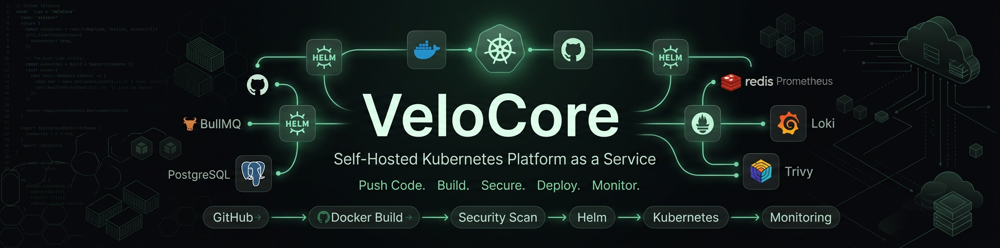

**Self-hosted Platform-as-a-Service built on Kubernetes that automatically builds, secures, deploys, and monitors full-stack applications.**

_Push code. VeloCore handles the Dockerfile, the Helm chart, the rollout, the monitoring, and the rollback._

[](#)
[](#)
[](#)
[](#)
[](#)
[](#)
[](#)
[](#)
[](#)
[](#)
[](#)
[](#)
[](#)
[](#license)

</div>

---

## Highlights

<div align="center">

|      170+       |         25+         |        17        |          4           |          3          |    100%     |
| :-------------: | :-----------------: | :---------------: | :------------------: | :-----------------: | :---------: |
| Backend Modules | Days of Development | Deployment Stages | Supported Frameworks | Observability Tools | Self-Hosted |

</div>

---

## About VeloCore

Deploying a full-stack application on Kubernetes today means writing a Dockerfile, hand-rolling Kubernetes manifests or Helm charts, wiring up Ingress and networking, standing up a monitoring stack, and gluing it all together with CI/CD — before a single line of application code goes live. That setup cost is the reason most side projects and small teams never touch Kubernetes directly, even when it's the right tool.

**VeloCore removes that setup cost.** It gives you the deploy experience of Railway, Render, or Vercel — connect a repo, click deploy — but runs entirely on your own Kubernetes cluster, so you keep full control of your infrastructure and your data.

**How it works, from the user's side:**

```
Login  →  Connect GitHub  →  Select Repository  →  Deploy
```

Everything after that — cloning, framework detection, image builds, security scanning, Helm chart generation, rollout, health checks, and monitoring — is automated by VeloCore's backend.

**Inspiration:** Railway, Render, Fly.io, Coolify, Vercel.

**What's different:** those platforms run on infrastructure you don't own. VeloCore is **self-hosted and Kubernetes-native** — it runs on your cluster, so there's no vendor lock-in, no per-seat billing, and no black box between your code and your infrastructure.

---

## Why I Built This

I wanted to actually understand how platforms like Railway, Render, and Coolify work internally — the orchestration, the Kubernetes plumbing, the build pipeline — rather than just using them. Reading docs and blog posts only gets you so far; the only way to really understand a deployment orchestrator is to build one and hit every edge case yourself: a rollout that "succeeds" but is actually broken, a build that works locally but not in a clean container, a queue that needs backpressure. So instead of building another CRUD app, I built the infrastructure layer underneath one.

Built solo over ~35 days, with Claude and ChatGPT as pair-programming and architecture-review partners throughout — useful for reasoning through Kubernetes rollout edge cases and getting a second opinion on design tradeoffs, but every architectural decision, the orchestration logic, and the actual debugging were mine. Treated it the way I'd treat a senior engineer on the team: good for catching blind spots, not a substitute for understanding what the system does.

---

## Demo

## 🚀 How to Deploy with VeloCore
<div align="center">
<a href="https://res.cloudinary.com/dcl9muhaa/video/upload/v1786253204/0809_1_gzt6hs.mp4" target="_blank" rel="noopener noreferrer">
  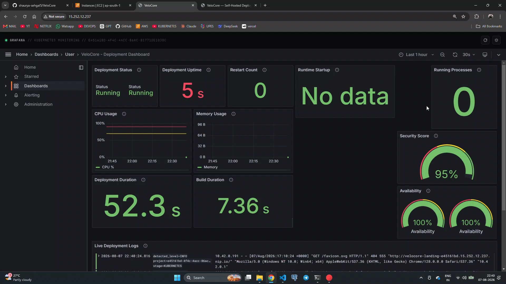
</a>
<p><i>▶ Click to watch the full deployment walkthrough</i></p>

</div>

**What happens when you deploy:**

```
Repository selected
        ↓
Repository cloned
        ↓
Framework detected
        ↓
Docker image built (BuildKit)
        ↓
Image security-scanned (Trivy)
        ↓
Helm chart generated
        ↓
Kubernetes rollout
        ↓
Application online
```

---

## Features

<table>
<tr>
<td width="50%" valign="top">

### Deployment Engine

**Supports**

✓ Express ✓ Next.js ✓ React (Vite)
✓ Python ✓ BullMQ Workers ✓ Multi-service Repos

- Automatic GitHub-triggered deployment
- Repository cloning
- Framework auto-detection
- Docker image generation via BuildKit
- Parallel image builds with layer caching
- BullMQ-backed deployment queue
- Namespace-per-project isolation
- Blue-green deployments
- Automatic rollback on failed rollout
- Full deployment history

### Runtime

- Central runtime registry
- Runtime Manager service
- Runtime API
- Continuous health checking
- Rolling updates
- Manual restart & scaling support
- Automatic Ingress generation

</td>
<td width="50%" valign="top">

### Monitoring

**Collects 20+ Prometheus metrics**

✓ Live Logs (Socket.IO) ✓ Runtime Metrics
✓ CPU ✓ Memory ✓ Restart Count
✓ Queue Metrics ✓ Deployment Metrics

- Long-term log storage via Loki
- Prebuilt Grafana dashboards
- Deployment duration tracking

### Security

- Repository-level scanning
- Docker image scanning via Trivy
- Automated security scoring
- Secret detection before deploy
- Hard deployment gate on critical CVEs

### Experience

- Deployment history & timeline
- Structured, filterable logs
- Runtime info at a glance
- Deployment event stream
- Real-time status tracking

</td>
</tr>
</table>

---

## Screenshots

### Dashboard

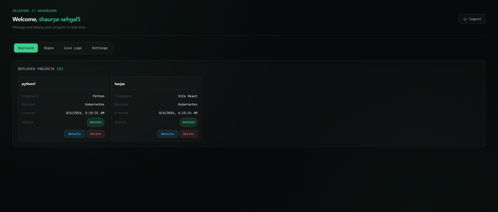

### Deployment

<table>
<tr>
<td>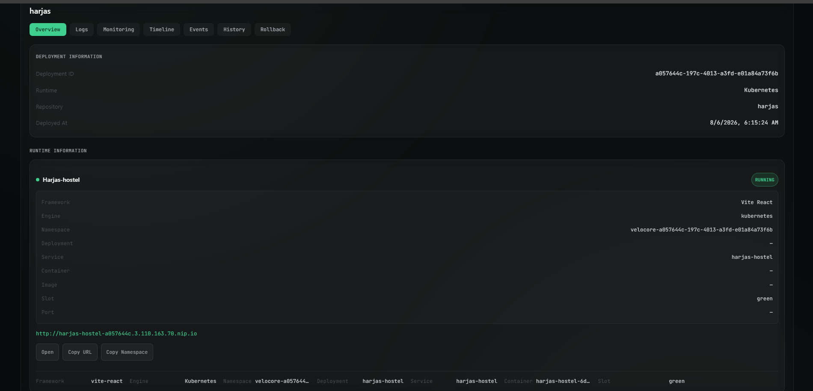<p align="center">Deployment Page</p></td>
<td>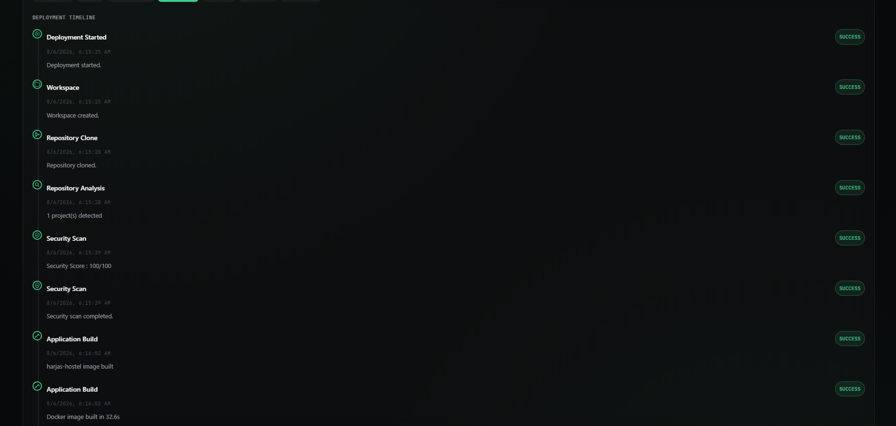<p align="center">Deployment Timeline</p></td>
</tr>
</table>

### Monitoring

<table>
<tr>
<td>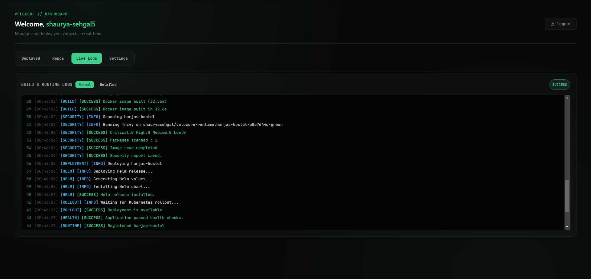<p align="center">Live Logs</p></td>
<td>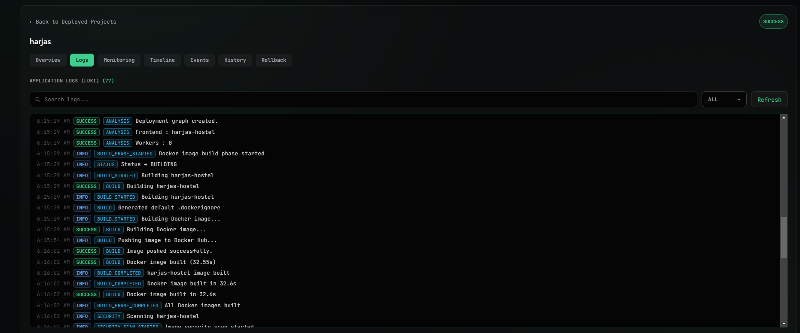<p align="center">Loki Log Search</p></td>
</tr>
<tr>
<td>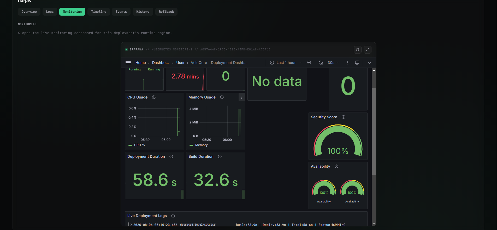<p align="center">Grafana</p></td>
</tr>
</table>

### Runtime

<table>
<tr>
<td>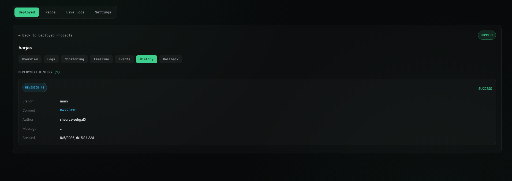<p align="center">History View</p></td>
<td>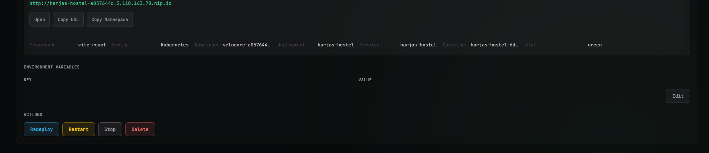<p align="center">Runtime</p></td>
</tr>
</table>

---

## Architecture

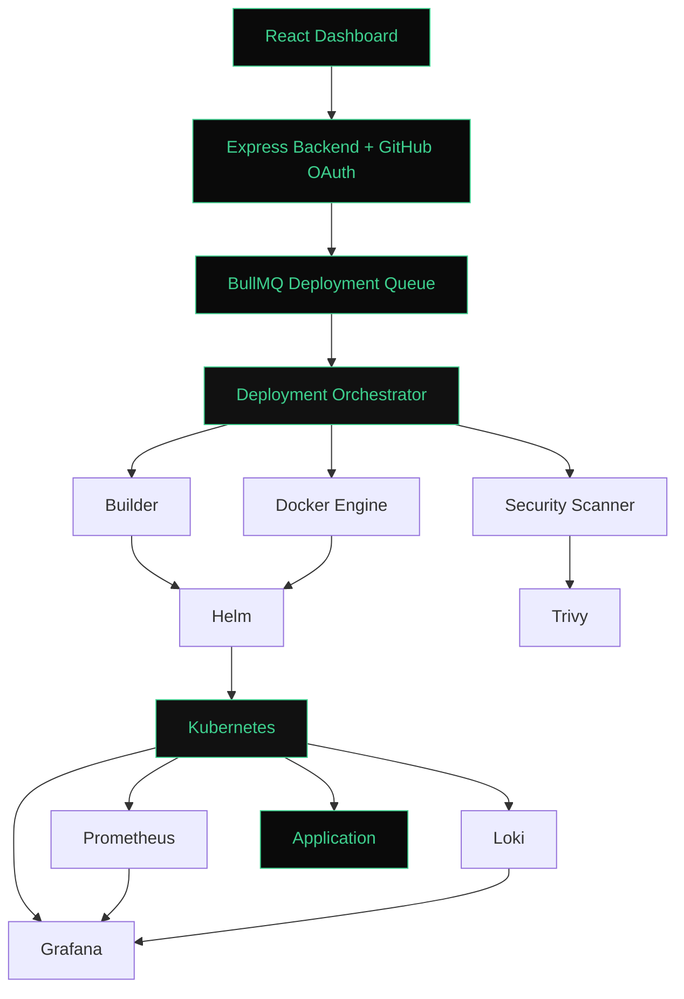

**Component responsibilities:**

| Component                   | Responsibility                                                                                                       |
| --------------------------- | -------------------------------------------------------------------------------------------------------------------- |
| **Deployment Orchestrator** | Coordinates every stage of a deployment — clone, build, scan, deploy, register — and owns rollback logic on failure. |
| **Builder**                 | Detects the project's framework and generates the correct Docker build plan for it.                                  |
| **Runtime Manager**         | Maintains the live registry of running deployments — health, ports, replica count, resource usage.                   |
| **Helm**                    | Turns a deployment plan into Kubernetes-native workloads (Deployment, Service, Ingress, ConfigMap, Secret).          |
| **BullMQ**                  | Queues and rate-limits deployments so concurrent triggers don't overwhelm the cluster.                               |
| **Trivy**                   | Scans built images for known CVEs and blocks deployment above a severity threshold.                                  |

---

## Deployment Pipeline

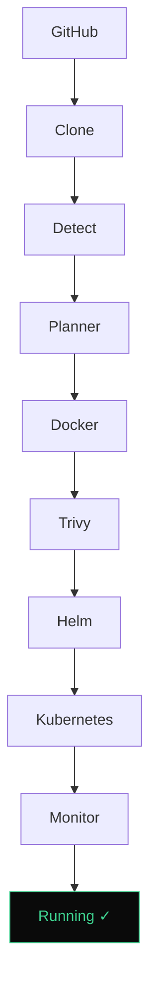

| Stage                    | What happens                                              |
| ------------------------ | --------------------------------------------------------- |
| 1. GitHub Authentication | OAuth handshake, repo access token issued                 |
| 2. Repository Clone      | Shallow clone into an isolated build workspace            |
| 3. Framework Detection   | Inspect `package.json` / `requirements.txt` / manifest    |
| 4. Dependency Graph      | Resolve build order for multi-service repos               |
| 5. Deployment Planning   | Choose base image, build strategy, resource limits        |
| 6. Docker Build          | BuildKit, layer-cached                                    |
| 7. Image Push            | Pushed to configured registry                             |
| 8. Security Scan         | Trivy scans the built image                               |
| 9. Helm Chart Generation | Values generated dynamically per runtime type             |
| 10. Namespace Creation   | Isolated namespace per project                            |
| 11. Deployment           | `helm install` / `upgrade`                                |
| 12. Rollout              | Kubernetes rolls out new pods                             |
| 13. Health Checks        | Liveness + readiness probes verified                      |
| 14. Runtime Registration | Deployment recorded in the runtime registry               |
| 15. Monitoring           | Prometheus starts scraping, Promtail starts shipping logs |
| 16. Live Logs            | Streamed to the dashboard over Socket.IO                  |
| 17. Running              | Application serving traffic                               |

If step 12 or 13 fails, the pipeline hands off to the **automatic rollback** flow instead of leaving a broken deployment live.

### Performance

| Stage                         | Typical Time |
| ----------------------------- | ------------ |
| Average end-to-end deployment | 35–60 sec    |
| Docker build                  | 8–20 sec     |
| Security scan                 | 5–10 sec     |
| Runtime registration          | < 1 sec      |
| Framework detection           | < 500 ms     |

---

## Tech Stack

| Layer              | Technology               | Why                                                                                                                                                  |
| ------------------ | ------------------------ | ---------------------------------------------------------------------------------------------------------------------------------------------------- |
| **Frontend**       | React + Vite             | Fast dev/build cycle; component architecture matches the dashboard's modular tab structure (Overview, Logs, Monitoring, Timeline, Events, Rollback). |
|                    | Socket.IO client         | Needed a persistent connection for live log tailing — polling REST for logs would be too slow and too chatty.                                        |
| **Backend**        | Node.js + Express        | Non-blocking I/O suits an orchestrator that's mostly waiting on Docker, Git, and Kubernetes API calls rather than doing heavy compute.               |
| **Queue**          | BullMQ + Redis           | Deployments must be serialized and rate-limited per project; BullMQ gives retries, concurrency control, and job state for free.                      |
| **Database**       | PostgreSQL               | Deployment history, runtime metadata, and security reports are relational and need real joins (deployment → events → security report).               |
| **Infrastructure** | Docker + Docker BuildKit | BuildKit's parallel layer builds and caching materially cut build time across multiple concurrent deployments.                                       |
|                    | Kubernetes               | The actual runtime target — namespaces for isolation, Deployments/Services/Ingress as the unit of work.                                              |
|                    | Helm                     | Templating Kubernetes manifests per-framework by hand doesn't scale; Helm values are generated dynamically instead.                                  |
| **Monitoring**     | Prometheus               | Standard pull-based metrics collection, native to the Kubernetes ecosystem.                                                                          |
|                    | Grafana                  | Dashboards on top of Prometheus + Loki without building a custom metrics UI.                                                                         |
|                    | Loki + Promtail          | Log aggregation designed to pair with Prometheus's label model — cheaper than Elasticsearch for this scale.                                          |
| **Security**       | Trivy                    | Open-source, fast, and covers both filesystem and container image scanning in one tool.                                                              |
| **CI/CD**          | GitHub OAuth + Webhooks  | Deployment triggers directly off repository events rather than a separate CI system.                                                                 |

<div align="center">


</div>

---

## Design Decisions

The choices behind the stack, and what I was trading off.

**BullMQ over RabbitMQ.** Deployments need job-level state (queued → active → completed/failed), retries with backoff, and per-project concurrency limits — BullMQ gives all three natively on top of Redis, which the project already needed for caching. RabbitMQ is more powerful as a general message broker, but it would have meant running a second piece of infrastructure and building job-state tracking myself on top of raw queues — complexity the deployment orchestrator didn't need.

**Helm over raw YAML manifests.** Every deployment produces a different combination of resources — a worker has no Service or Ingress, a web app does, a multi-service repo needs several coordinated releases. Hand-writing and templating raw YAML per framework would mean maintaining N manifest sets by hand. One parameterized Helm chart with dynamically generated values collapses that into a single chart that adapts to whatever the build plan describes.

**PostgreSQL over MongoDB.** Deployment data is inherently relational: a deployment has events, services, a security report, and scoped env vars, and the dashboard needs to query across those relationships (e.g., "full timeline for this deployment, joined with its security report"). That's a natural fit for foreign keys and joins. MongoDB's flexible schema doesn't buy much here since the schema _is_ well-defined — it would just push the joins into application code.

**Loki over Elasticsearch.** Loki indexes only metadata labels and stores log content as compressed chunks, which is dramatically cheaper than Elasticsearch's full-text indexing for the volume of logs a multi-tenant deployment platform generates. It also pairs natively with Prometheus's label model, so the same label set (`project`, `deployment_id`, `pod`) works across metrics and logs without maintaining two separate tagging schemes.

**Prometheus over InfluxDB.** Prometheus is the default in the Kubernetes ecosystem — kube-state-metrics, cAdvisor, and most Helm charts already expose Prometheus-format metrics out of the box, so there was nothing to bridge. Its pull-based scraping model also fits a platform managing many short-lived, dynamically-created pods better than InfluxDB's push model would.

**Socket.IO over polling.** Deployment logs need to feel instant — a user watching a build shouldn't see logs arrive in 2-second batches. Socket.IO keeps a persistent connection open and pushes log lines as they're written, which is both lower-latency and lower-overhead than the dashboard polling a REST endpoint every few seconds across potentially many concurrent deployments.

---

## Folder Structure

```
velocore/
├── .github/                 # GitHub Actions workflows
├── backend/
│   ├── config/              # Configuration files
│   ├── controllers/         # API controllers
│   ├── helm/               # Backend Helm manifests
│   ├── middleware/         # Express middleware
│   ├── monitoring/         # Metrics & monitoring services
│   ├── queues/             # BullMQ job queues
│   ├── routes/             # API routes
│   ├── services/           # Core business logic (Builder, Deployer, Runtime, Docker, Security)
│   ├── templates/          # Dockerfile templates for supported frameworks
│   ├── utils/              # Utility functions
│   ├── app.js              # Express application
│   ├── server.js           # Application entry point
│   └── Dockerfile          # Backend container image
│
├── Database/               # Database schema, migrations
│
├── deploy/
│   ├── argocd/             # ArgoCD application manifests
│   └── helm/
│       ├── dashboards/     # Grafana dashboard JSONs
│       ├── templates/      # Kubernetes resource templates
│       ├── Chart.yaml      # Helm chart metadata
│       ├── values.yaml     # Default Helm values
│
├── frontend/
│   ├── src/
│   │   ├── components/     # Reusable React components
│   │   ├── hooks/          # Custom React hooks
│   │   ├── App.jsx         # Root application
│   │   ├── Dashboard.jsx   # Deployment dashboard
│   │   ├── Login.jsx       # Authentication page
│   │   ├── config.js       # Frontend configuration
│   │   ├── statusMeta.js   # Deployment status metadata
│   │   └── utils.js        # Frontend utilities
│   ├── Dockerfile          # Frontend container image
│   ├── nginx.conf          # Nginx production configuration
│   └── vite.config.js      # Vite configuration
│
├── terraform/              # Infrastructure as Code (AWS resources)
├── docker-compose.yml      # Local development stack
├── LICENSE
└── README.md
```

---

## Database Schema

```
users ──< projects ──< deployments ──< deployment_events
                              │
                              ├──< deployment_services
                              ├──< deployment_security
                              └──< deployment_envs
```

| Table                 | Purpose                                                                          |
| --------------------- | -------------------------------------------------------------------------------- |
| `users`               | Authentication and account data.                                                 |
| `projects`            | Linked GitHub repositories.                                                      |
| `deployments`         | One row per deployment attempt — status, timestamps, commit SHA.                 |
| `deployment_services` | Runtime metadata for each running service (for multi-service repos).             |
| `deployment_events`   | Ordered timeline of pipeline stage transitions, used to render the Timeline tab. |
| `deployment_security` | Trivy scan results and computed security score per deployment.                   |
| `deployment_envs`     | Environment variables scoped to a project/deployment.                            |

---

## Kubernetes Architecture

| Resource           | Why it's used                                                                                                         |
| ------------------ | --------------------------------------------------------------------------------------------------------------------- |
| **Namespace**      | Hard isolation boundary — one per project, so a bad deploy in one project can't touch another's resources or network. |
| **Deployment**     | Manages the pod replica set for a running service and drives rolling updates.                                         |
| **Service**        | Stable internal networking endpoint for pods behind a Deployment.                                                     |
| **Ingress**        | Routes external traffic to the right Service based on generated hostnames.                                            |
| **ConfigMap**      | Non-secret runtime configuration, decoupled from the image.                                                           |
| **Secret**         | Environment variables and credentials, kept out of the image and out of plain manifests.                              |
| **Health Probes**  | Liveness/readiness checks gate traffic and drive the rollout success/failure decision.                                |
| **Helm**           | Templating layer that turns a deployment plan into all of the above, consistently.                                    |
| **Rolling Update** | Zero-downtime replacement of old pods with new ones.                                                                  |
| **Rollback**       | Reverts to the last known-good release when a rollout fails health checks.                                            |

---

## Monitoring Stack

```
Application → Prometheus → Metrics → Grafana
Application → Logs → Promtail → Loki → Grafana / Dashboard
```

**Metrics collected:** CPU usage, memory usage, pod restart count, queue depth (BullMQ), active deployment count, runtime count, rollout duration, security score.

---

## Security

```
Repository Scan → Secret Detection → Docker Build → Trivy Scan
        → Critical Vulnerabilities Check → Security Report → Deployment Gate
```

Every image is scanned before it reaches a cluster. The **security score** is computed from CVE severity distribution (critical/high/medium/low counts, weighted) plus whether secrets were found in the repository or image layers. Deployments above a configurable critical-CVE threshold are blocked at the gate rather than silently shipped.

---

## Automatic Rollback

This is the feature I'm proudest of, because it's the one that actually required understanding Kubernetes rollout semantics rather than just calling an API.

```
Deployment starts
        ↓
Health checks run against new pods
        ↓
        ├── Pass → traffic shifted, deployment marked successful
        │
        └── Fail / rollout timeout
                    ↓
            Failure analysis (probe logs, exit codes, event reasons)
                    ↓
            Previous successful deployment looked up
                    ↓
            Previous Helm release restored
                    ↓
            Runtime registry updated to match restored state
                    ↓
            Status updated, event logged, user notified
```

**Why it exists:** a Kubernetes rollout can "succeed" at the infrastructure level (pods scheduled, containers running) while the application inside is still broken — crash-looping on a missing env var, or a config that fails silently. Watching pod status alone isn't enough; VeloCore verifies rollout health against actual liveness/readiness probe results and a timeout window, and only then decides whether to promote or roll back.

---

## Future Roadmap

**✅ Completed**

- Automatic rollback
- Monitoring stack (Prometheus + Grafana)
- Runtime Manager
- Live logs (Socket.IO + Loki)
- Security scanning (Trivy)

**🚧 In Progress**

- Blue-green deployments
- Custom domains

**📌 Planned**

- Canary deployments
- Horizontal Pod Autoscaler integration
- Service mesh (Istio/Linkerd)
- Multi-cluster support
- Automatic SSL
- GitOps / ArgoCD sync
- Multi-region deployments
- AI deployment assistant (build-failure diagnosis)

---

## Installation

### Requirements

| Requirement     | Version / Notes                                            |
| --------------- | ---------------------------------------------------------- |
| OS              | Ubuntu 20.04+ (or any Linux with Docker + kubectl support) |
| Docker          | 24+                                                        |
| Kubernetes      | 1.27+ (cluster with kubectl access)                        |
| Helm            | 3.12+                                                      |
| Node.js         | 18+                                                        |
| Redis           | 7+                                                         |
| PostgreSQL      | 14+                                                        |
| Minimum RAM     | 4 GB (control plane + services)                            |
| Recommended CPU | 2+ cores                                                   |

```bash
# Clone
git clone https://github.com/shaurya-sehgal5/VeloCore.git
cd velocore

# Backend
cd backend
npm install
cp .env.example .env   # fill in values, see below
npm run dev

# Frontend
cd ../frontend
npm install
npm run dev

# Deploy the platform itself onto Kubernetes
cd ../helm
helm install velocore ./velocore-chart -f values.yaml
```

---

## Environment Variables

| Variable                                    | Why it exists                                                                                                                                |
| ------------------------------------------- | -------------------------------------------------------------------------------------------------------------------------------------------- |
| `APP_DOMAIN`                                | Base domain used to generate live URLs for every deployed application — without it, generated Ingress hosts have nothing to resolve against. |
| `REDIS_HOST`                                | Points BullMQ at the Redis instance backing the deployment queue; without it, no deployment job can be enqueued or processed.                |
| `DATABASE_URL`                              | PostgreSQL connection string — stores deployment metadata, runtime state, events, and security reports.                                      |
| `GITHUB_CLIENT_ID` / `GITHUB_CLIENT_SECRET` | OAuth app credentials that let VeloCore authenticate users and read their repositories on their behalf.                                      |
| `JWT_SECRET`                                | Signs and verifies user session tokens; rotating this invalidates all active sessions.                                                       |
| `LOKI_URL`                                  | Endpoint for the Loki instance that durably stores logs beyond the live Socket.IO stream.                                                    |
| `PROMETHEUS_URL`                            | Endpoint the backend queries to pull live metrics into the dashboard's Monitoring tab.                                                       |

---

## Engineering Challenges

The parts of this project that didn't come from a tutorial.

**Designing the deployment orchestrator.** The hardest architectural problem wasn't any single stage — it was coordinating clone → build → scan → deploy → runtime-registration as one pipeline where any stage can fail independently, and failure has to leave the system in a known, recoverable state rather than half-deployed. I ended up modeling each stage as an explicit state transition recorded in `deployment_events`, so the orchestrator (and the UI) always knows exactly which stage a deployment is in and can resume reasoning about it after a crash or restart — instead of inferring state from log output.

**One build pipeline, multiple frameworks.** Supporting Express, Vite/React, Next.js, Python services, and BullMQ workers through a single pipeline meant the _pipeline_ had to stay generic while the _build plan_ stayed framework-specific. Framework detection inspects manifest files (`package.json` scripts, `requirements.txt`, presence of `next.config.js`, etc.) and produces a build plan object — base image, build command, start command, exposed port — that the rest of the pipeline consumes without caring what framework it came from. Adding a new framework means adding a detector and a template, not touching the orchestrator.

**Generating Helm values dynamically.** Static Helm charts don't work when the workload shape changes per deployment — a worker service has no Ingress or exposed port, a web service does, a repo with three services needs three coordinated releases. Instead of maintaining separate charts per framework, I built one parameterized chart and generate its `values.yaml` at deploy time from the build plan, so the same chart correctly produces a headless worker Deployment or a web Deployment + Service + Ingress depending on what it's given.

**Health checks and rollback that trust probes, not pod status.** Early on, "rollout succeeded" just meant the pods were `Running`. That's not the same as the application being healthy — a container can be running and still crash-looping on startup errors invisible to `kubectl get pods`. I moved rollback decisions to actual readiness/liveness probe outcomes over a timeout window, and on failure, the orchestrator looks up the last known-good Helm release and restores it, then re-syncs the runtime registry so the dashboard never shows a broken deployment as live.

**Live logs vs. durable logs.** Users watching a deployment want to see logs _now_, streamed as they happen — but debugging a failure two days later means those logs need to still exist somewhere. Socket.IO handles the live tail straight from the pod, while Promtail ships everything to Loki in parallel for long-term storage and querying. The two paths are decoupled on purpose: if the Socket.IO connection drops, the deployment isn't affected, and if Loki ingestion lags, the live view still works.

**Keeping logs useful without drowning the user.** Raw container logs are noisy — dependency install output, framework boot logs, health check pings. The dashboard's live log view filters and buckets by pipeline stage so a user sees a concise, stage-labeled stream, while the _full_ unfiltered log is still queryable through the Loki Log Query API for actual debugging. That split — concise by default, detailed on demand — came directly out of testing the tool on my own deployments and finding the raw output unusable.

**Metrics that mean something for a deployment platform, not just a cluster.** Standard Prometheus/Grafana setups monitor cluster health; VeloCore also needs to monitor the _platform itself_ — queue depth, active deployment count, rollout duration per deployment. I added custom metrics exported from the orchestrator alongside standard cAdvisor/kube-state-metrics data, so the same Grafana dashboards show both "is the cluster healthy" and "is VeloCore itself performing well."

**Modeling deployment data relationally.** A deployment isn't one row — it has a timeline of events, per-service runtime state, a security report, and scoped environment variables, all of which need to be queried together (e.g., "show me the full history of this deployment including why it failed"). Structuring this in PostgreSQL as `deployments` with related `deployment_events`, `deployment_services`, and `deployment_security` tables — rather than jamming JSON blobs into a single row — is what makes the Timeline and Rollback tabs in the dashboard possible without expensive log parsing at read time.

---

## Lessons Learned

Building this end to end meant getting hands-on with things a tutorial doesn't force you to internalize:

✓ Docker BuildKit and layer caching strategy
✓ Kubernetes rollouts, probes, and rollback semantics
✓ Helm templating and dynamic values generation
✓ BullMQ job orchestration and queue design
✓ Prometheus metric design and PromQL
✓ Grafana dashboard construction
✓ Loki + Promtail log pipelines
✓ Platform engineering as a discipline, not just "using Kubernetes"
✓ Runtime state management across service restarts
✓ Designing a multi-stage orchestrator with recoverable failure states

---

## License

MIT License — see [LICENSE](LICENSE) for full terms.

You are free to:

✔ Modify · ✔ Fork · ✔ Use commercially · ✔ Use privately

---

## About the Developer

VeloCore was designed and developed by **Shaurya Sehgal** as a production-grade Platform Engineering project to demonstrate real-world DevOps, cloud-native, Kubernetes, and infrastructure automation skills — end to end, from orchestration logic to the monitoring stack to the UI that surfaces it all.

[](#)
[](#)
[](#)
[](#)
[](#)
